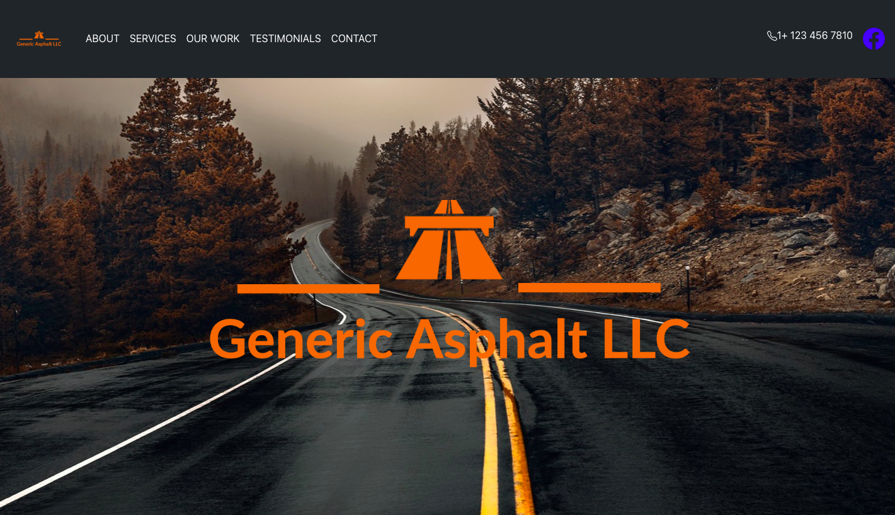

# Construction Company Landing Page

## Date: 5/10/2022

### By: Brandon Hernandez

#### [Portfolio](https://portfolio-theta-plum.vercel.app/) | [GitHub](https://github.com/brandonhernandez123) | [LinkedIn](www.linkedin.com/in/brandonhdzgtz) | [Demo](https://asphalt-company-cmkm2ofr2-brandonhernandez123.vercel.app/)
***

### ***Description***
#### I built a Construction Company Landing page after I had a client backout and said he didn't think I was capable of producing anything worth his time.
***

### ***Technologies Used***
* React

* React Bootstrap
* Material UI
***

### ***Screenshots***

##### Landing Page

***

***

### ***Credits***

##### Testimonial Images: [Google Search](Google.com)

##### Background Images: [istock](istockphoto.com)

##### Construction Icons: [FlatIcon](flaticon.com)
***